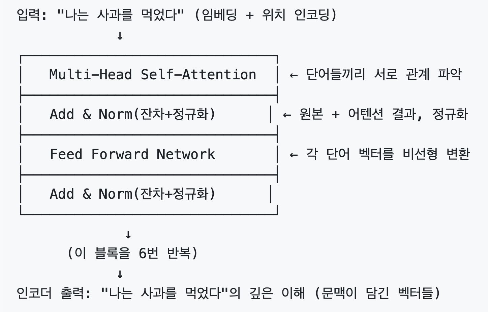
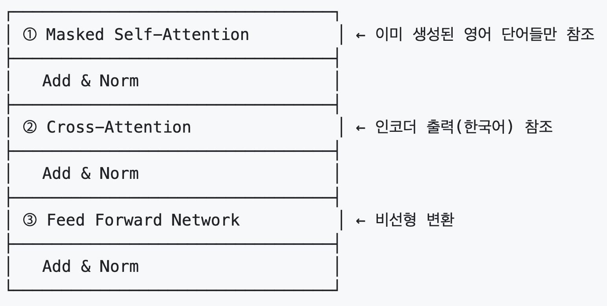

# LLM 모델과 Transformer 
## 소프트웨어 개발 방식의 변화
> 핵심 메시지
> S/W 3.0: **LLM**을 활용한 **지능형 에이젼트**가 코드를 작성하는 시대 -> 개발자는 문제정의자(기획자)와 > 사고설계자(아키텍트)로 역할 변화 필요 
> AI를 기계나 도구가 아니라 동료로 생각하는 시대가 되었다.
> 이러한 시대에 LLM의 한계(블랙박스, 편향, 할루시네이션, 비결정적)와 동작원리를 이해하는 사람이 경쟁력을 갖게 됩니다.

### 개요
- Software 2.0: 머신러닝은 특정 작업(추천, 이미지처리, 번역, 이상탐지 등) 마다 특화된 AI 모델이 필요
- Software 3.0: 트랜스포머는 대부분의 작업에 범용적으로 적용 가능

* LLM은 도구가 아니라 함께 일하는 동료가 되고 있다.
  
### S/W 3.0 한계
- 블랙박스(Black box): 추론과정 모름 -> 설명 한계
- 편향(Bias): 학습 데이터의 편향
- 할루시네이션(Hallucination): 가짜 생성
- 비결정적(Non-deterministic): 결과가 매번 조금씩 다름

---

## NLP 시간 핵심   
- LLM이 가진 모든 단어의 묶음을 Corpus(말뭉치)라 하고 거기서 필요한 단어들만 끄집어 내서 구성한 것을 Vocabulary(어휘사전)이라 함 
- 벡터라이징과 임베딩: AI가 처리할 수 있게 텍스트를 연속된 숫자로 바꾸는게 벡터라이징. 이때 의미있는 숫자로 바꾸는게 임베딩
- 임베딩을 위해 단어의 빈도를 이용하는 대표적 방법이 TF-IDF이며 RAG의 BM25(Best Matching 25)로 발전함

## 딥러닝 개요
- 분포가설: 임베딩의 이론적 기본 이론
  - 어떤 단어의 의미는 그 주변 단어를 기반으로 분석할 수 있다.
  - 주변 단어가 비슷한 단어들은 유사한 의미일것이다.  
- 역전파란? 딥러닝은 정답과의 오차를 많은 반복을 통해 줄여 나가는 학습법. 이 오차를 줄이는 과정을 역전파라 함.
- 임베딩과 차원 의미: 
  - 차원은 한 단어의 의미를 바라보는 관점. 이 차원은 인간이 정하는게 아니고 임베딩 모델이 정함
    https://github.com/cna-bootcamp/aistudy/blob/main/mldl/textbook/03.deep-learning.md#%EC%9E%84%EB%B2%A0%EB%94%A9
  - 임베딩의 목적은 각 차원의 가중치(파라미터)를 조정하여 의미가 비슷한 단어들을 주변에 모이게 하는 것 

---

## LM(언어모델)
- RNN은 역전파 과정에서 기울기가 점점 작아져 학습 안되는 vanishing gradient 현상 발생 
- LSTM과 GRU: 
  - 목적: 역전파 단계가 많아져도 메모리가 소실되지 않게 하자
  - 과거 정보와 새로운 정보를 적절히 섞어 메모리를 업데이트
- Attention
  - 답변 후보의 확률을 계산할 때 질문의 단어 중 관련 높은 단어에 주목해 보자 
    -> 인간도 질문에 답변할 때 질문 중 중요한 단어를 생각하면서 가장 최상 답변한다.
  - 동음이의어/다의어를 구분 못하는 워드임베딩의 한계를 Contextual 임베딩(단어간의 관계 이용)으로 극복
  
## 트렌스포머 기본 개념
- 단어가 유사하다는 건 거리가 가깝다는 의미 -> 1 - 유사도 = 거리
- 내적(Dot Product): 
  - 두 벡터의 유사도를 코사인 유사도로 계산한 결과
  - 유사도를 각 벡터가 바라보는 방향간의 각도로 계산: 
  - 내적: 1(cos 0도)이면 완전 동일, 0(cos 90도)이면 전혀 안 닮음
  - 벡터의 길이를 동일한 크기로 맞춰 비교할 수 있어서 코사인 유사도를 씀
* WHY 내적이 중요?
- 학습: 다음 토큰을 맞히도록 가중치를 조정하는 과정에서, 내적을 통해 기울기가 움직이며 관련 있는 벡터끼리 가까워짐
- 어텐션: 각 토큰의 질의(Q)와 다른 토큰의 키(K)를 내적해, 어디를 얼마나 참조할지 가중치를 배분함
- 추론: 마지막 은닉 벡터와 각 토큰 임베딩을 내적해, 값이 가장 큰 토큰을 답으로 선택함
   
- 선형변환(Linear transformation)
  - 입력벡터와 가중치를 행렬 연산하여 결과값을 계산하는 것
  - 가중치를 계속 조정하여 결과값을 정답에 맞게 조정하기 위해 사용    
  - 행렬연산 특징: (1,3) * (3, 2) -> 가운데 3 없어지고 (1,2)이 됨
- Softmax
  - 결과 벡터의 값을 합이 1이 되도록 0 ~ 1 사이로 고르게 분포시키는 함수 
  
## Transformer
- (중요) LSTM, GRU 한계: 병렬처리 불가(순차처리만 가능), 장기의존성(순차 처리 하다보니 앞에 기억을 잃어 버림) 문제 발생
- 트렌스포머는 병렬처리 아키텍처로 변경함으로써 장기의존성 문제를 해결
- 목적: 질문을 잘 이해(Encoder)하고 가장 좋은 답변을 내자(Decoder) 
   
### Encoder

> Encoder의 목적은 **입력 문장을 제대로 이해하는 것**이고, 이걸 단어 하나씩이 아니라
> **한꺼번에** 처리합니다.
> 여기서 입력 문장이란 여러분이 넣은 프롬프트를 임베딩한 벡터들이죠.
>
> 여러분이 문장을 이해할 때 무엇을 하시나요?
> - 단어들이 서로 **어떻게 연결되는지**를 봅니다. "그것"이 무엇을 가리키는지,
>   어떤 서술어가 어떤 목적어를 받는지 → 이게 **Self-Attention**
> - 문장 전체를 한 번에 받아 모든 단어 쌍을 동시에 계산하니까 **병렬 처리**죠.
>   앞에서 뒤로 한 단어씩 넘겨야 했던 RNN과 결정적으로 다른 점입니다.
>
> Query와 Key를 내적해 "어디를 얼마나 볼지" 비율을 정하고, 그 비율로 Value를 섞습니다.

- 각 단어 벡터에 가중치 행렬을 곱해 세 가지 역할의 벡터를 만듭니다
  - **Query(질의)**: 나는 무엇을 찾고 있나
  - **Key(색인)**: 나는 무엇을 제공하나
  - **Value(내용)**: 참조될 때 실제로 넘길 내용
  - 예) 도서관에서 책 찾기 — 검색어가 Query, 책 목차가 Key, 실제 본문이 Value
- ⚠️ 중요: Q, K, V는 **같은 입력 문장에서 나오지만 서로 다른 벡터**입니다
  ```
  Q = 입력 벡터 × W_Q
  K = 입력 벡터 × W_K      ← 세 행렬이 서로 다름!
  V = 입력 벡터 × W_V
  ```
  - 출처가 같아서 "Self"-Attention이고, 가중치가 달라서 세 역할로 갈립니다
  - 만약 Q와 K가 같다면 내적이 대칭이 되어 모든 단어가 자기 자신만 보게 됩니다.
    "밥을 **먹었다**"에서 *먹었다*는 목적어를 찾고 *밥을*은 서술어를 찾죠.
    이 **방향의 차이**를 표현하려고 행렬을 나눈 겁니다

- 처리 과정 (아래 1~6번이 **한 층**이고, 이 층을 **6번 반복**합니다)

  - **1. 토큰화 & 임베딩**: 입력 문장을 토큰으로 쪼개고 각각을 벡터로 변환

  - **2. 위치 인코딩(Positional Encoding)**
    - 각 토큰의 위치 정보를 벡터에 심는 작업
    - 어텐션은 순서 개념이 없어서, 이걸 안 하면 "개가 사람을 물었다"와
      "사람이 개를 물었다"가 똑같아집니다
    - Sin/Cos 함수를 이용

  - **3. Multi-Head Self-Attention**
    - 여러 관점으로 문장을 보기 위한 목적: 예) 문법, 의미, 시간, 감성적 관점
    - 헤드마다 전체 차원을 나눠 갖고 동시에 계산합니다 (예: 512차원 ÷ 8헤드 = 64차원)
    - 각 헤드 내부 처리
      - ① 단어 간 관련성 계산: **Q · Kᵀ** 내적
      - ② **√d_k(Key 차원의 제곱근)로 나눔** — 차원이 크면 내적 값이 너무 커져
        Softmax가 한 곳으로 쏠리고 학습이 멈춥니다. 그걸 막는 안전장치
      - ③ **Softmax**로 변환 → **Attention Score**
        (0~1 사이이면서 **한 줄의 합이 1인 비율**입니다)
      - ④ 그 비율로 **Value를 가중합** → **Attention Output**
        (내적이 아니라 "비율대로 섞기"입니다)
    - 마지막에 모든 헤드 결과를 이어 붙이고 가중치(W_O)를 한 번 더 곱해 하나로 통합
    - 결과: 단어 간 관계가 반영된 벡터 → **문장의 맥락을 이해한 상태**

  - **4. 잔차연결 + 정규화(Add & Norm)** — 순서대로 Add 먼저, Norm 나중
    - **잔차연결(Add)**: 이 층에 들어온 원래 벡터를 어텐션 결과에 **더해줌**
      - 원래 정보를 잃지 않게 하고, 층을 깊게 쌓아도 **기울기가 사라지지 않게** 함
      - 최종 판단할 때 원래 문장을 한 번 더 떠올리는 셈이죠
    - **정규화(Norm)**: 각 단어 벡터의 **값 분포를 평균 0, 분산 1로** 맞춤
      - 층마다 값이 튀는 것을 막아 학습을 안정시킵니다

  - **5. FFN(Feed Forward Network)**
    - 어텐션이 모아온 정보를 **각 단어별로 따로** 가공·정리하는 단계
      (맥락 섞기는 어텐션 담당, FFN은 단어마다 독립 적용)
    - 차원을 **4배**로 늘렸다가(512 → 2048) 다시 원래 차원으로 줄임
    - 중간에 **ReLU/GELU 같은 비선형 함수**를 통과시킵니다
      - 이게 없으면 아무리 층을 쌓아도 결국 하나의 선형 변환과 같아집니다

  - **6. 잔차연결 + 정규화(Add & Norm)**: FFN 결과에 대해 동일하게 수행

- **Encoder 출력**: 문맥이 담긴 벡터들. 이 결과가 Decoder의 Cross-Attention으로
  **K, V로서 전달**됩니다

- 개념도
  


### Decoder

> Decoder의 목적은 **가장 좋은 답변을 만들어내는 것**입니다.
> Encoder가 "이해"라면 Decoder는 "작성"이죠.

- 개념도
  
  > 개념도의 "한국어→영어"는 번역 예시입니다. 본문의 "입력 문장 → 답변"과 같은 구조입니다.

- 처리과정 (아래 1~8번이 **한 층**이고, 이 층을 **6번 반복**합니다)

  - **1. 토큰화 & 임베딩**
    - 학습 시: 정답 문장을 토큰화 + 임베딩
      - 맨 앞에 `<sos>`를 붙여 **한 칸 밀어 넣습니다(shifted right)**.
        t번째 자리에서 t+1번째 단어를 예측하게 하려고요
    - 추론 시: 모델 출력이 **이미 토큰 ID**라서 토큰화는 생략, **임베딩부터** 수행

  - **2. 위치 인코딩(Positional Encoding)**
    - 답변 토큰의 위치 정보를 심는 작업. Encoder와 동일한 Sin/Cos 함수 이용
    - 추론 시에도 **매 토큰마다 반드시** 수행합니다 (생략하면 순서 정보가 사라짐)

  - **3. Masked Multi-Head Self-Attention**
    - 여러 관점으로 "지금까지 쓴 답변"을 이해하기 위한 목적
    - Encoder의 Self-Attention과 계산은 같으나, **아직 안 쓴 미래 단어를 가립니다**
      - 미래 어텐션 점수를 -∞로 만들어 Softmax 후 0이 되게 함
      - 정답을 미리 보면 학습이 안 되기 때문이죠
    - 각 헤드 내부: Q · Kᵀ → √d_k로 나눔 → Softmax(Attention Score)
      → Value 가중합 → Attention Output
    - 결과: 지금까지 작성한 답변의 흐름을 이해한 벡터

  - **4. 잔차연결 + 정규화(Add & Norm)**

  - **5. Cross-Attention**
    - 계산 방식은 Self-Attention과 같지만 **재료의 출처가 다릅니다**
      - **Q = 답변 쪽** 벡터 (지금 뭘 쓰려 하는가)
      - **K, V = Encoder의 최종 출력** (입력 문장을 이해한 결과)
    - 목적: 이 단어를 쓰기 위해 **입력 문장의 어디를 봐야 하는지** 찾는 것
    - 여기엔 미래 가리기(Masking)가 **없습니다**. 입력 문장은 전부 봐도 되니까요
    - Encoder와 Decoder를 잇는 유일한 통로가 바로 이 단계입니다

  - **6. 잔차연결 + 정규화(Add & Norm)**

  - **7. FFN(Feed Forward Network)**
    - 차원을 **4배**로 늘렸다가 비선형 함수를 통과시키고 원래 차원으로 줄임
    - 단어별로 독립 적용

  - **8. 잔차연결 + 정규화(Add & Norm)**: FFN 결과에 대해 수행

  - **9. 출력층 — 실제 단어를 고르는 마지막 단계**
    - 마지막 벡터와 **모든 토큰의 임베딩을 내적**해 점수(로짓)를 만듭니다
      - 이때 쓰는 행렬은 1번의 **임베딩 행렬을 재사용**합니다 (weight tying)
    - Softmax를 거쳐 확률로 바꾸고, 가장 높은 토큰을 선택
    - 그 토큰을 다시 1번 입력으로 되돌립니다 → `<eos>`가 나올 때까지 반복
      ```
      <sos>    → 임베딩 → 위치인코딩 → Decoder → "나는"
      "나는"   → 임베딩 → 위치인코딩 → Decoder → "밥을"
      "밥을"   → 임베딩 → 위치인코딩 → Decoder → "먹었다"
      "먹었다" → 임베딩 → 위치인코딩 → Decoder → <eos>  ← 종료
      ```
    - **학습은 병렬(정답 전체를 한 번에), 추론은 순차(한 토큰씩)** — 이 차이가 핵심입니다

> 참고: 지금 설명한 구조는 원논문의 Encoder-Decoder입니다.
> GPT·Claude 같은 실제 LLM은 **Decoder만 사용**하고, Cross-Attention 없이
> 프롬프트와 생성 토큰이 하나의 스택을 함께 통과합니다.